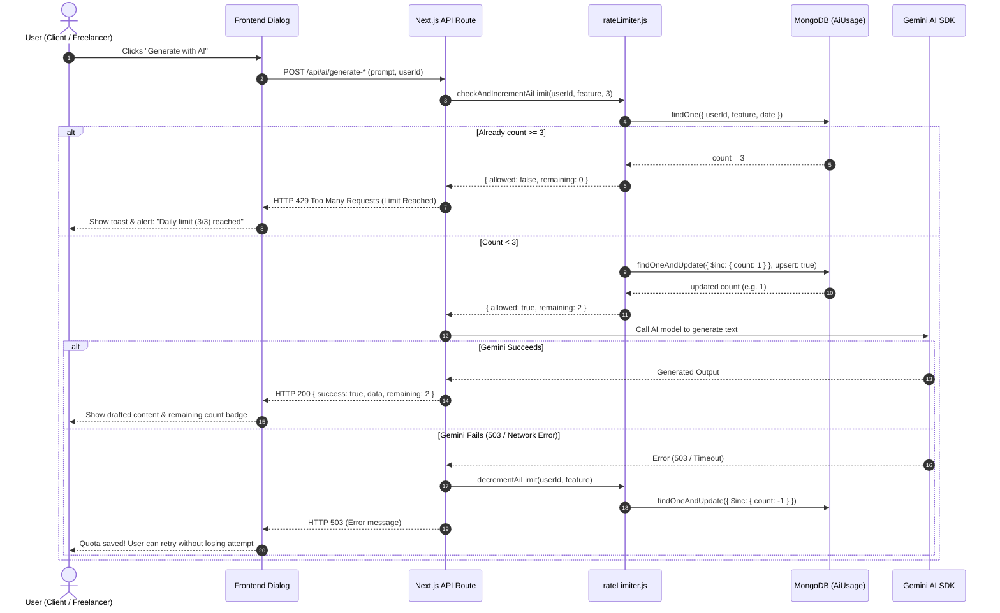

# 🛡️ Karmsetu GenAI Daily Rate Limiter (Max 3 Tries / Day)

Yeh document Karmsetu ke GenAI features (**Client Project Generator** & **Freelancer Proposal Generator**) ke liye implement kiye gaye **Daily Rate Limiting System (Max 3 Tries Per Day)** ko aasan, tod-todkar aur casual Hinglish me explain karta hai. 

Is document ko padhkar aap kisi bhi technical interview me confidently explain kar sakte hain ki **Rate Limiting kyu zaroori hai, humne Redis ke bajay MongoDB atomic counter kyu chuna, aur race conditions ko kaise handle kiya gaya.**

---

## 📌 1. Problem Statement (Hame iski zaroorat kyu padi?)

Jab humne Gemini AI ko Karmsetu me integrate kiya, tab do main problems samne aayi:
1. **Free Tier / Paid Quota Exhaustion:** Agar koi user baar-baar "Generate" button click karega, to API quota turant khatam ho jayega ya heavy billing aayegi.
2. **503 Spikes & Service Abuse:** Agar multiple users bina kisi limit ke AI model ko bombard karenge, to Google ke servers se `503 Service Unavailable / High Demand` errors aane lagenge.

### Hamara Rule:
> **"Har user (Client ho ya Freelancer) ek din me maximum 3 baar hi AI generation use kar sakega. Raat ke 12:00 baje (IST) quota automatically reset ho jayega."**

---

## 🏗️ 2. Architectural Decision: Redis vs MongoDB Atomic Counter

Technical interviews me sabse pehla sawaal pucha jata hai:
> *"Rate limiting ke liye to Redis use hota hai, aapne MongoDB kyu use kiya?"*

| Parameter | Redis / Upstash | MongoDB Atomic Counter (Hamara Approach) |
| :--- | :--- | :--- |
| **Extra Infrastructure** | Alag se Redis server host karna padta ya Upstash/Aiven ka paid subscription lena padta. | **Zero Extra Infrastructure.** Karmsetu already MongoDB + Mongoose use kar raha hai. |
| **Cold Starts & Serverless** | Next.js serverless functions me TCP connection pooling handle karni padti. | Existing MongoDB connection pool se natively jud jata hai. |
| **Race Condition Safety** | `INCR` command se handle hota hai. | MongoDB ke **`$inc` operator** se 100% atomic rehta hai. |
| **Storage / Memory Bloat** | In-memory RAM consume karta hai. | **MongoDB TTL Index** ke through 48 hours baad purane records automatically delete ho jate hain. |
| **Decision** | Chhote/Medium scale projects me unnecessary complexity. | **Most practical, cost-effective & production-ready solution.** |

---

## 🗄️ 3. Database Design: `AiUsage` Model

Humne ek dedicated lightweight model banaya: [`src/app/(models)/AiUsage.js`](file:///d:/Minor%203/karmsetu/src/app/%28models%29/AiUsage.js)

### Schema Breakdown:
```javascript
const aiUsageSchema = new Schema(
  {
    userId: {
      type: String,
      required: true,
      trim: true,
      index: true,
    },
    feature: {
      type: String,
      required: true,
      enum: ["project", "proposal"], // Client = project, Freelancer = proposal
      trim: true,
    },
    date: {
      type: String,
      required: true,
      trim: true, // Format: "YYYY-MM-DD" (e.g., "2026-09-24")
    },
    count: {
      type: Number,
      required: true,
      default: 0,
      min: 0,
    },
    createdAt: {
      type: Date,
      default: Date.now,
      expires: 172800, // 48 ghante baad MongoDB is document ko auto-delete kar dega (TTL)
    },
  },
  { timestamps: true }
);

// 🔑 Compound Unique Index
aiUsageSchema.index({ userId: 1, feature: 1, date: 1 }, { unique: true });
```

### Is Schema ke 3 Super Smart Concepts:

1. **Compound Unique Index (`{ userId: 1, feature: 1, date: 1 }`):**
   - Yeh ensure karta hai ki ek user ke liye ek din me ek feature ka **sirf ek hi document** banega.
   - Database me duplicate rows nahi ban sakti.
   - Search query super-fast (O(log N)) hoti hai.

2. **Date as String (`"YYYY-MM-DD"`):**
   - Hume koi daily midnight cron job chalane ki zaroorat hi nahi hai!
   - Jaise hi agla din hoga (e.g., `2026-09-25`), query naye date key ko search karegi, aur purana record touch bhi nahi hoga. Quota automatic reset!

3. **TTL (Time-To-Live) Index (`expires: 172800`):**
   - 172,800 seconds = 48 ghante.
   - MongoDB ka background thread 2 din purane records ko chupchap delete kar deta hai. Database kabhi bharega nahi.

---

## ⚙️ 4. Step-by-Step Flow (Tod-Todkar Explanation)

Yeh pura flow [`src/lib/ai/rateLimiter.js`](file:///d:/Minor%203/karmsetu/src/lib/ai/rateLimiter.js) me execute hota hai.



---

## 🔍 5. Deep-Dive: Code Implementation Details

### Step A: Date nikaalna (Timezone Consistency)
```javascript
export function getTodayDateKey() {
  // Asia/Kolkata timezone use karte hain taaki sabhi Indian users ke liye
  // raat 12:00 baje exact reset ho
  return new Intl.DateTimeFormat("en-CA", {
    timeZone: "Asia/Kolkata",
  }).format(new Date());
}
```

### Step B: Atomic Increment & Race Condition Safety
Agar do tabs me user ne ek hi second me double-click kar diya:
```javascript
export async function checkAndIncrementAiLimit(userId, feature, maxLimit = 3) {
  await connect();
  const date = getTodayDateKey();

  // 1. Quick check: Agar pehle se hi 3 hai to bina wajah write mat karo
  const existing = await AiUsage.findOne({ userId, feature, date }).lean();
  if (existing && existing.count >= maxLimit) {
    return {
      allowed: false,
      count: existing.count,
      remaining: 0,
      message: `Aapka aaj ka AI generation limit (${maxLimit}/${maxLimit}) pura ho chuka hai. Kripya kal dobara koshish karein.`,
    };
  }

  // 2. Atomic $inc: Single database operation
  const updated = await AiUsage.findOneAndUpdate(
    { userId, feature, date },
    {
      $inc: { count: 1 },
      $setOnInsert: { createdAt: new Date() },
    },
    { upsert: true, new: true, setDefaultsOnInsert: true }
  );

  // Agar parallel request race condition me aayi aur limit cross ho gayi
  if (updated.count > maxLimit) {
    return {
      allowed: false,
      count: updated.count,
      remaining: 0,
      message: `Aapka aaj ka AI generation limit (${maxLimit}/${maxLimit}) pura ho chuka hai. Kripya kal dobara koshish karein.`,
    };
  }

  return {
    allowed: true,
    count: updated.count,
    remaining: Math.max(0, maxLimit - updated.count),
  };
}
```

### Step C: Graceful Rollback on Failure (`decrementAiLimit`)
Kayi systems me jab AI 503 error deta hai, user ka attempt ginti me jud jata hai aur user bina kisi galti ke apna chance kho deta hai. Humne isko solve kiya:
```javascript
export async function decrementAiLimit(userId, feature) {
  try {
    if (!userId) return;
    await connect();
    const date = getTodayDateKey();

    // Sirf tab decrement karo jab count > 0 ho
    await AiUsage.findOneAndUpdate(
      { userId, feature, date, count: { $gt: 0 } },
      { $inc: { count: -1 } }
    );
  } catch (err) {
    console.error("Failed to decrement AI usage quota on error:", err.message);
  }
}
```

---

## 🎨 6. Frontend Integration & UX

### 1. Client Side ([`AIProjectGeneratorDialog.jsx`](file:///d:/Minor%203/karmsetu/src/components/CreateJob/AIProjectGeneratorDialog.jsx)):
- Dialog ke top header me badge dikhta hai: **`Max 3 tries/day`** ya **`2/3 left today`**.
- Post request me `clientId` pass hota hai (prop se ya `sessionStorage.getItem("karmsetu")` se).
- Agar status 429 aata hai, to red alert banner aur toast me clear message display hota hai:
  > *"Aapka aaj ka AI generation limit (3/3) pura ho chuka hai. Kripya kal dobara koshish karein."*

### 2. Freelancer Side ([`jobdetails/[...jobId]/page.jsx`](file:///d:/Minor%203/karmsetu/src/app/%28freelancer%29/fl/jobdetails/%5B...jobId%5D/page.jsx)):
- Request me `freelancerId` pass hota hai jo Zod schema se validate hota hai.
- Success toast me clear hint milta hai:
  > *"AI proposal drafted! (2 generations left today)"*
- Quota khatam hone par friendly toast notification aata hai.

---

## 🎤 7. Interview Q&A Cheatsheet (Quick Revision)

### Q1: Rate limit check karne ke liye standard HTTP status code kya hota hai?
**Answer:** `HTTP 429 Too Many Requests`. Yeh standard RFC 6585 status code hai jo client ko batata hai ki usne given time window me maximum allowed requests exceed kar li hain.

### Q2: Race condition kya hoti hai aur `$inc` ne ise kaise solve kiya?
**Answer:** Agar hum pehle `findOne()` karke count nikalte aur code me `count + 1` karke `save()` karte, to agar ek user 2 requests simultaneous bhejta, dono requests ko `count = 2` dikhta aur dono save ho jati (total 4 attempts ho jate).
MongoDB ka **`$inc` operator** database level par atomic locking provide karta hai, jisse single operation me atomically value increment hoti hai.

### Q3: Mid-night reset bina kisi cron job ke kaise kaam karta hai?
**Answer:** Document ka primary lookup key `{ userId, feature, date }` hai jisme date `YYYY-MM-DD` hoti hai. Agle din date string change ho jati hai (jaise `2026-09-24` se `2026-09-25`), isliye agle din automatically naya document create hota hai zero count ke sath. Purane din ke document ko delete karne ki jaldi nahi hoti.

### Q4: Database me purane din ke records jama ho kar memory full nahi karenge?
**Answer:** Nahi, humne schema me `createdAt` field par TTL index lagaya hai:
`createdAt: { type: Date, default: Date.now, expires: 172800 }`.
MongoDB ka background thread har 60 seconds me check karta hai aur 48 ghante (172800s) se purane documents ko automatically purge (delete) kar deta hai.

### Q5: Agar AI API down ho to user ka attempt waste hone se kaise bachaya?
**Answer:** Humne `try / catch` block ke andar Gemini AI call ko wrap kiya hai. Agar Gemini API 503 ya network error throw karta hai, to `catch` block me hum `decrementAiLimit(userId, feature)` call kar dete hain, jisse user ka count wapas `-1` ho jata hai. User ka quota safe rehta hai.

---

## 📁 Modified & Created Files Summary

| File | Type | Purpose |
| :--- | :--- | :--- |
| [`src/app/(models)/AiUsage.js`](file:///d:/Minor%203/karmsetu/src/app/%28models%29/AiUsage.js) | **Created** | Mongoose model with Compound Unique Index & TTL 48h expiry |
| [`src/lib/ai/rateLimiter.js`](file:///d:/Minor%203/karmsetu/src/lib/ai/rateLimiter.js) | **Created** | Atomic limiter logic, IST date utility, rollback helper |
| [`src/app/api/ai/generate-project/route.js`](file:///d:/Minor%203/karmsetu/src/app/api/ai/generate-project/route.js) | **Modified** | Daily limit check (3/day) for Client + rollback on error |
| [`src/app/api/ai/generate-proposal/route.js`](file:///d:/Minor%203/karmsetu/src/app/api/ai/generate-proposal/route.js) | **Modified** | Daily limit check (3/day) for Freelancer + rollback on error |
| [`src/components/CreateJob/AIProjectGeneratorDialog.jsx`](file:///d:/Minor%203/karmsetu/src/components/CreateJob/AIProjectGeneratorDialog.jsx) | **Modified** | Client ID resolution, 429 UI toast/alert, quota badge |
| [`src/components/CreateJob/index.jsx`](file:///d:/Minor%203/karmsetu/src/components/CreateJob/index.jsx) | **Modified** | Passing `clientId` to AI dialog |
| [`src/app/(freelancer)/fl/jobdetails/[...jobId]/page.jsx`](file:///d:/Minor%203/karmsetu/src/app/%28freelancer%29/fl/jobdetails/%5B...jobId%5D/page.jsx) | **Modified** | Showing remaining tries in toast & handling 429 status code |
| [`AiRateLimit.md`](file:///d:/Minor%203/karmsetu/AiRateLimit.md) | **Created** | Complete Hinglish interview and architecture guide |
